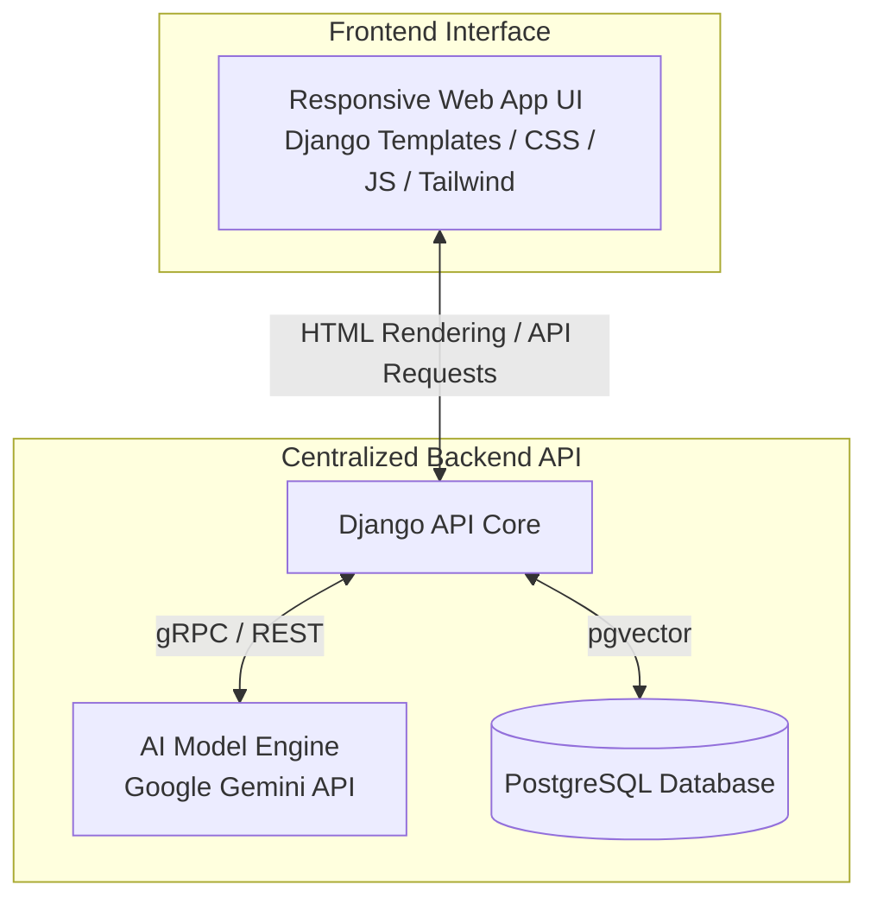

# ADAPT Platform: Complete System Architecture

This document defines the overarching system architecture for the ADAPT (Advanced Digital Assistant for Patient Tracking) ecosystem. The system operates on a centralized backend that powers a unified, responsive web application designed to run seamlessly on both desktop and mobile devices.

## High-Level Ecosystem

The ADAPT platform is composed of **two major components**:

---

## 1. Centralized Backend (The Core)
The backend acts as the single source of truth for data, authentication, and artificial intelligence processing.

*   **Framework:** Django (Python) + Django REST Framework (DRF)
*   **Database:** PostgreSQL with `pgvector` for advanced AI embeddings and search functionality.
*   **AI Engine Base:** Google Gemini AI API. This industry-level, free-tier model powers the "Assist Mode". The backend abstracts the AI logic so that the web client gets consistent AI responses across all devices.
*   **Key Responsibilities:**
    *   Manage Patient and Task data via ORM.
    *   Expose RESTful endpoints (`/api/patients/`, `/api/tasks/`, `/api/assistant/`) for dynamic page elements (like the chat window).
    *   Process AI queries centrally to avoid duplicate logic.

## 2. Responsive Web App UI
A single unified frontend optimized for all screen sizes (desktops, tablets, and smartphones) using responsive CSS layout and Tailwind components.

*   **Stack:** Django Templates, Vanilla CSS/JS, TailwindCSS.
*   **Connection:** Directly interfaces with the Django backend (monolithic rendering) but also consumes backend API endpoints dynamically for asynchronous features (like the chat interface and quick task entry).
*   **Use Cases:**
    *   **Desktop/Tablet:** Deep administrative control, detailed schedule management, and comprehensive analytics viewing.
    *   **Mobile Phone:** On-the-go patient care, immediate AI assistance via the floating action launcher, quick task entry, and viewing daily routines while interacting with patients.

---

## Data & Authentication Flow

1.  **Caretaker Access:** Caretakers log into the web application via their desktop or mobile browsers.
2.  **Session & Request:** Django handles session authentication for HTML requests and authenticates API requests securely.
3.  **Data Rendering:** Django renders responsive templates (e.g., patient lists, dashboards, and routines) dynamically with page layouts that scale down gracefully to mobile screen sizes.
4.  **AI Request (Assist Mode):** The caretaker opens the chat launcher (which displays as a full-screen drawer on mobile or side-panel drawer on desktop). The chatbot sends a prompt to `/api/assistant/ask/`.
5.  **Centralized Processing:** Django receives the prompt, attaches relevant database context (using `pgvector` for RAG - Retrieval-Augmented Generation), and sends it to the **Google Gemini API**.
6.  **Response:** Gemini returns the result to Django, which returns it as JSON to render inside the dynamic chat UI on the caretaker's device.

This unified architecture ensures that we only build and maintain **a single responsive frontend codebase** that handles both desktop and mobile viewports.
