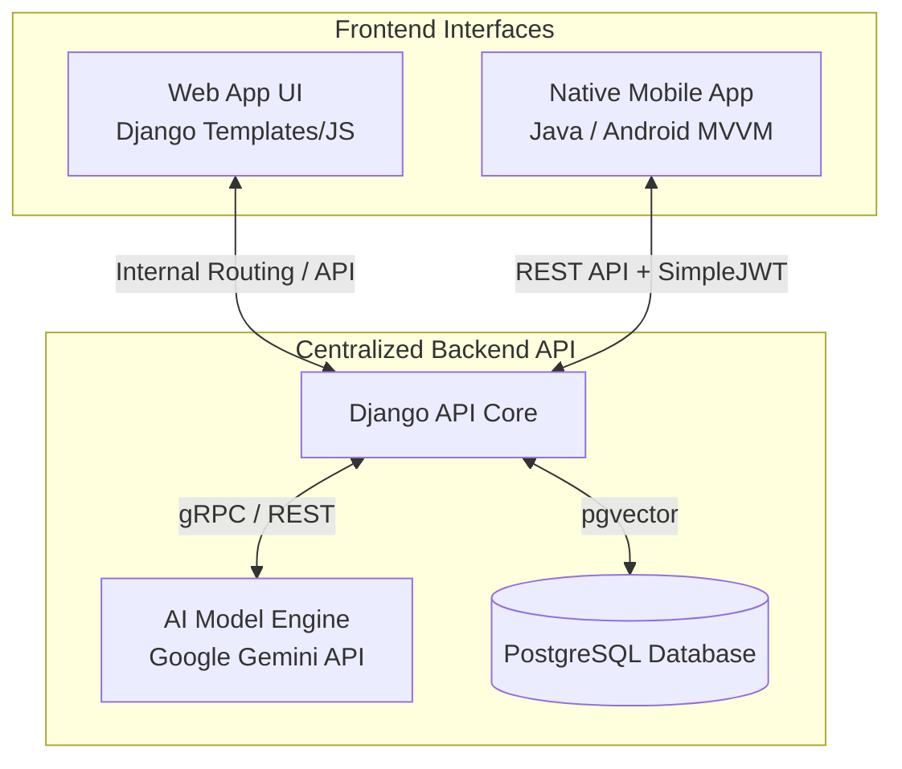

# ADAPT Platform: Complete System Architecture

This document defines the overarching system architecture for the ADAPT (Advanced Digital Assistant for Patient Tracking) ecosystem. Based on the project requirements, the system operates on a centralized backend that powers both a web application and a native mobile application.

## High-Level Ecosystem

The ADAPT platform is composed of **three major components**:

---

## 1. Centralized Backend API (The Core)
The backend acts as the single source of truth for data, authentication, and artificial intelligence processing.

*   **Framework:** Django (Python) + Django REST Framework (DRF)
*   **Database:** PostgreSQL with `pgvector` for advanced AI embeddings and search functionality.
*   **Authentication:** `SimpleJWT` for robust token-based authentication (stateless), allowing the mobile app and any decoupled frontend to securely access the endpoints.
*   **AI Engine Base:** Google Gemini AI API. This industry-level, free-tier model powers the "Assist Mode" across all platforms. The backend abstracts the AI logic so that both the web and mobile apps get identical, consistent AI responses.
*   **Key Responsibilities:**
    *   Manage Patient and Task data via ORM.
    *   Expose RESTful endpoints (`/api/auth/`, `/api/patients/`, `/api/tasks/`).
    *   Process AI queries centrally to avoid duplicate logic on client sides.

## 2. Web App UI
The web-based portal intended primarily for desktop or larger screens.

*   **Stack:** Django Templates, Vanilla CSS/JS, and potentially lightweight frameworks like Alpine.js or HTMX for dynamic behavior.
*   **Connection:** Directly interfaces with the Django backend (monolithic rendering) but can also consume the REST API for dynamic, asynchronous updates (like the AI chat interface).
*   **Use Case:** Deep administrative control, detailed schedule management, and comprehensive analytics viewing.

## 3. Native Java Mobile App
The mobile interface designed for on-the-go patient care, built specifically for Android.

*   **Stack:** Java, Android SDK, MVVM Architecture.
*   **Connection:** Communicates exclusively with the **Centralized Backend API** via HTTP/REST (using Retrofit or standard HttpURLConnection).
*   **Authentication:** Obtains JWT tokens from `/api/auth/token/` and includes them in the Authorization header (`Bearer <token>`) for all subsequent data requests.
*   **Use Case:** Quick task entry, immediate AI assistance via the floating action button, and viewing daily routines while interacting with patients.

---

---

## Data & Authentication Flow

1.  **Login:** The Native Java App sends credentials to the Django `/api/auth/token/` endpoint.
2.  **Token:** Django verifies credentials against the PostgreSQL DB and returns an Access Token and Refresh Token.
3.  **Data Fetching:** The Mobile App requests patient data (`GET /api/patients/`) passing the Access Token.
4.  **AI Request:** The Mobile App's "Assist Mode" sends a prompt (`POST /api/assistant/ask/`).
5.  **Centralized Processing:** Django receives the prompt, attaches relevant database context (using `pgvector` for RAG - Retrieval-Augmented Generation), and sends it to the **Google Gemini API**.
6.  **Response:** Gemini returns the result to Django, which structures it as JSON and returns it to the Native App.

This 3-tier architecture ensures that the **logic is written only once (in Django)** and seamlessly shared across the Web and Native Mobile platforms.
